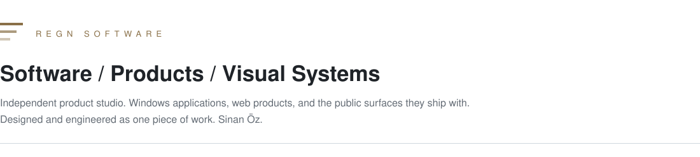

  <picture>
    <source media="(prefers-color-scheme: dark)" srcset="./assets/hero-dark.svg">
    
  </picture>

  
  
  

 

<table width="100%">
  <tr>
    <td width="33%" valign="top">
      

        
        
      

      
<strong><a href="https://github.com/Regncreative/Pulse">Pulse</a></strong> 
      Windows observability · v1.1.0

    </td>
    <td width="33%" valign="top">
      

        
        
      

      
<strong><a href="https://github.com/Regncreative/Stash">Stash</a></strong> 
      File shelf for Windows

    </td>
    <td width="33%" valign="top">
      

        
        
      

      
<strong><a href="https://github.com/Regncreative/fiyat-avcisi">Fiyat Avcısı</a></strong> 
      E-commerce price intelligence

    </td>
  </tr>
</table>

 

<table width="100%">
  <tr>
    <td width="50%" valign="top">
      
        
      
      &nbsp;<strong>PULSE</strong>
       
      Windows observability
      
Read-only diagnostics: Event Log activity in plain language, live system health, hardware inventory, and local reports. Observation only. Nothing leaves the machine.

      

        
        
      

      

        
        
        
      

      

        <a href="https://github.com/Regncreative/Pulse">Repository</a>
        &nbsp;·&nbsp;
        <a href="https://pulse.regncreative.com">pulse.regncreative.com</a>
      

    </td>
    <td width="50%" valign="top">
      <a href="https://github.com/Regncreative/Stash">
        <picture>
          <source media="(prefers-color-scheme: dark)" srcset="https://raw.githubusercontent.com/Regncreative/Stash/main/docs/panel-dark.jpg">
          
        </picture>
      </a>
        
      
      &nbsp;<strong>STASH</strong>
       
      File shelf for Windows
      
Collect, organize, and drag files from the system tray. References only — files stay on disk. Built to sit in Fluent Windows 11 chrome, not as a typical tray utility.

      

        
        
      

      

        
        
        
      

      

        <a href="https://github.com/Regncreative/Stash">Repository</a>
        &nbsp;·&nbsp;
        <a href="https://stash.regncreative.com">stash.regncreative.com</a>
      

    </td>
  </tr>
  <tr>
    <td colspan="2" valign="top">
      
        
      
      &nbsp;<strong>FIYAT AVCISI</strong>
       
      E-commerce price intelligence
      
Track products, store price history, and fire alerts on a target price or percent drop. Auth, dashboard, workers, and a multi-strategy crawler — a product stack, not a scraper script.

      

        
        
      

      

        
        
        
        
      

      

        <a href="https://github.com/Regncreative/fiyat-avcisi">Repository</a>
        &nbsp;·&nbsp;
        <a href="https://fiyatavcisi.com">fiyatavcisi.com</a>
        &nbsp;·&nbsp;
        <a href="https://app.fiyatavcisi.com">app.fiyatavcisi.com</a>
      

    </td>
  </tr>
</table>

 

<table width="100%">
  <tr>
    <td width="33%" valign="top" align="center">
      
<strong><a href="https://github.com/Regncreative/Pulse-web">Pulse-web</a></strong>

      
Official landing page for Pulse

      

        
        
      

      
<a href="https://pulse.regncreative.com">Live</a>

    </td>
    <td width="33%" valign="top" align="center">
      
<strong><a href="https://github.com/Regncreative/Stash-Website">Stash-Website</a></strong>

      
Official landing page for Stash

      

        
        
      

      
<a href="https://stash.regncreative.com">Live</a>

    </td>
    <td width="33%" valign="top" align="center">
      
<strong><a href="https://github.com/Regncreative/fiyat-avcisi-web">fiyat-avcisi-web</a></strong>

      
Official landing page for Fiyat Avcısı

      

        
        
      

      
<a href="https://fiyatavcisi.com">Live</a>

    </td>
  </tr>
</table>

 

  Desktop 
  

  Web 
  

  Data 
  

  
  
  
  

 

<table width="100%">
  <tr>
    <td align="center" width="18%"><strong>Graphic Design</strong></td>
    <td align="center" width="5%"></td>
    <td align="center" width="18%"><strong>Visual Systems</strong></td>
    <td align="center" width="5%"></td>
    <td align="center" width="18%"><strong>UI / UX</strong></td>
    <td align="center" width="5%"></td>
    <td align="center" width="18%"><strong>Software</strong></td>
    <td align="center" width="5%"></td>
    <td align="center" width="18%"><strong>Products</strong></td>
  </tr>
</table>

Regn Software treats interface language as part of the architecture. 
Hierarchy, material, and native behavior are specified with the same discipline as the service underneath. 
Local-first where it matters. Read-only where the system should not be touched.

 

  
  

  

 

  
  
  

