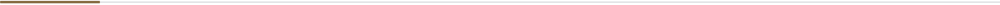

<picture>
  <source media="(prefers-color-scheme: dark)" srcset="./assets/regn-logo-dark.svg">
  
</picture>

# Software / Products / Visual Systems

Independent studio building Windows applications, web products and the visual systems around them. Interface, product behaviour and engineering are specified as one piece of work.

<table>
  <tr>
    <td><b>OPERATOR</b></td>
    <td>Sinan Öz — founder, design &amp; engineering</td>
  </tr>
  <tr>
    <td><b>FOCUS</b></td>
    <td>Desktop software · Web products · UI/UX</td>
  </tr>
  <tr>
    <td><b>ORIGIN</b></td>
    <td>Graphic design · Brand &amp; visual systems</td>
  </tr>
  <tr>
    <td><b>BASED IN</b></td>
    <td>Turkey</td>
  </tr>
</table>

<table width="100%">
  <thead>
    <tr>
      <th align="left">
        
        &nbsp;<code>01</code>&nbsp; PULSE &nbsp;·&nbsp; WINDOWS OBSERVABILITY
      </th>
    </tr>
  </thead>
  <tbody>
    <tr>
      <td>
        Read-only diagnostics for Windows. Event Log activity in plain language, live system health, hardware inventory and local reports. Observation only — nothing leaves the machine.
          
        
        
        
        
      </td>
    </tr>
    <tr>
      <td>
        
        
        
          
        <a href="https://github.com/Regncreative/Pulse"><b>Repository ↗</b></a>
        &nbsp;&nbsp;
        <a href="https://pulse.regncreative.com"><b>Website ↗</b></a>
      </td>
    </tr>
  </tbody>
</table>

<table width="100%">
  <thead>
    <tr>
      <th align="left">
        
        &nbsp;<code>02</code>&nbsp; STASH &nbsp;·&nbsp; FILE SHELF FOR WINDOWS
      </th>
    </tr>
  </thead>
  <tbody>
    <tr>
      <td>
        A file shelf in the system tray. Drop files onto shelves, pin what matters, drag them back into any app. Stash stores references only — files stay where they are on disk.
          
        
        
        
        
      </td>
    </tr>
    <tr>
      <td>
        
        
        
          
        <a href="https://github.com/Regncreative/Stash"><b>Repository ↗</b></a>
        &nbsp;&nbsp;
        <a href="https://stash.regncreative.com"><b>Website ↗</b></a>
      </td>
    </tr>
  </tbody>
</table>

<table width="100%">
  <thead>
    <tr>
      <th align="left">
        
        &nbsp;<code>03</code>&nbsp; FİYAT AVCISI &nbsp;·&nbsp; E-COMMERCE PRICE INTELLIGENCE
      </th>
    </tr>
  </thead>
  <tbody>
    <tr>
      <td>
        Self-hostable price tracking. Products are crawled on a schedule, price history is stored, and alerts fire on a target price or percent drop. Auth, dashboard, workers and a multi-strategy crawler.
          
        
        
        
        
      </td>
    </tr>
    <tr>
      <td>
        
        
        
          
        <a href="https://github.com/Regncreative/fiyat-avcisi"><b>Repository ↗</b></a>
        &nbsp;&nbsp;
        <a href="https://fiyatavcisi.com"><b>Website ↗</b></a>
        &nbsp;&nbsp;
        <a href="https://app.fiyatavcisi.com"><b>App ↗</b></a>
      </td>
    </tr>
  </tbody>
</table>

<b>DESKTOP</b> — Flutter · Dart · C++20 · CMake · Electron

<b>WEB</b> — TypeScript · React · Next.js · Vite · Tailwind CSS

<b>BACKEND &amp; DATA</b> — Node.js · Express · PostgreSQL · Redis · SQLite

<b>SYSTEM</b>

Each product ships with its own marketing surface, designed and built in-house.

<table width="100%">
  <tr><td><code>01</code>&nbsp; <b>GRAPHIC DESIGN</b> &nbsp;— form, type, composition</td></tr>
  <tr><td><code>02</code>&nbsp; <b>VISUAL SYSTEMS</b> &nbsp;— identity, hierarchy, consistency</td></tr>
  <tr><td><code>03</code>&nbsp; <b>UI / UX</b> &nbsp;— behaviour, state, native feel</td></tr>
  <tr><td><code>04</code>&nbsp; <b>SOFTWARE</b> &nbsp;— services, desktop shells, platforms</td></tr>
  <tr><td><code>05</code>&nbsp; <b>DIGITAL PRODUCTS</b> &nbsp;— shipped, versioned, maintained</td></tr>
</table>

Design is treated as specification, not decoration. A product is defined by its material language and its behaviour on the machine it belongs to — then engineered to match. Local-first where it matters. Read-only where the system should not be touched.

